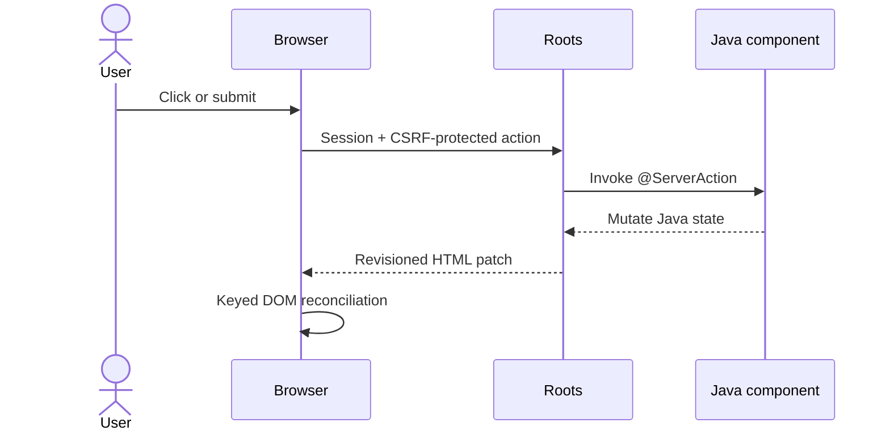

<div align="center">

# Roots

### Java in. HTML out.

[](https://github.com/chaplinkyle/roots/actions/workflows/ci.yml)
[](https://openjdk.org/projects/jdk/26/)
[](LICENSE)
[](docs/roadmap.md)

**A small, server-driven, full-stack Java web framework with components, live
rerendering, annotated actions, and convention-based routing.**

</div>

Roots is for Java teams that want the useful conventions of Next.js and the
component ergonomics of React without making application developers maintain a
second JavaScript application.

Pages, layouts, reusable components, state, events, API routes, sessions, and
background work are ordinary Java. Roots renders accessible HTML on the server
and ships its own dependency-free browser driver for event transport, navigation,
and keyed DOM reconciliation. There is no React, Node.js, npm, hydration pass, or
application-authored JavaScript.

> [!IMPORTANT]
> Roots is a working **0.1.0-SNAPSHOT** foundation, not a production-stable 1.0
> release. It is suitable for evaluation, prototypes, and controlled single-node
> applications. Read [Production readiness](docs/production-readiness.md) before
> using it for sensitive or highly available systems.

## Why Roots

- **One application language.** UI behavior, backend logic, and APIs are Java.
- **Real components.** Props, composition, retained state, lifecycle callbacks,
  context, memoization, error boundaries, refs, and async fallbacks are implemented.
- **Live server actions.** A browser event invokes Java, rerenders the live tree,
  and returns a revisioned HTML patch.
- **Conventions over wiring.** Java packages become pages, layouts, dynamic routes,
  catch-all routes, and API handlers.
- **Tiny browser boundary.** The current unminified driver is about 9.7 KiB and
  uses browser APIs directly—no client library is embedded.
- **JDK-only core.** `roots-core` has no runtime dependency outside Java.
- **Enterprise-shaped defaults.** HTML escaping, CSP, same-origin actions,
  session-bound CSRF tokens, request limits, and stale-patch protection are built in.
- **No magic build stack.** Applications are normal Maven projects and package as
  executable JARs.

## A live Java component

```java
@ViewComponent("approval-counter")
public final class ApprovalCounter implements Component {
    private final State<Integer> approved = State.of(0);

    @Override
    public Node render(PageContext context) {
        return section(
            strong(approved.get()),
            button("Approve next")
                .type("button")
                .onClick(this, "approve")
        );
    }

    @ServerAction
    private void approve() {
        approved.update(count -> count + 1);
    }
}
```

Keep a stateful component in a page field so its Java identity survives live
rerenders:

```java
@PageMetadata(
    title = "Operations",
    description = "The JVM is the full stack.",
    stylesheets = "/app.css"
)
public final class Page implements dev.roots.Page {
    private final ApprovalCounter approvals = new ApprovalCounter();

    @Override
    public Node render(PageContext context) {
        return main(h1("Operations"), approvals);
    }
}
```

No controller, client store, JSON DTO, hook rule, or event script is required.

## How rerendering works



The server remains authoritative. Browser actions are serialized per live view,
and monotonically increasing revisions prevent older responses from overwriting
newer state. Background work can run on virtual threads and push patches through
Server-Sent Events.

## What is implemented

| Area | Available today |
|---|---|
| Components | composition, record props, retained `State<T>`, keyed lists |
| Events | click, submit, and change bindings; lambdas or `@ServerAction` |
| Rendering | escaped HTML tree, fragments, conditional/list rendering, unsafe escape hatch |
| Lifecycle | mount/unmount callbacks, typed context, dependency-keyed memoization |
| Resilience | error boundaries, stale-revision rejection, bounded async patch queue |
| Async UI | virtual-thread loaders, fallback UI, failure UI, SSE patches |
| Browser effects | refs, focus, scroll-into-view, clipboard |
| Routing | package pages, nested layouts, dynamic/catch-all routes, `@Route` overrides |
| Framework | metadata annotations, API routes, static assets, sessions, client navigation |
| Tooling | Maven archetype, executable-JAR example, Maven Wrapper, CI |
| Security baseline | output escaping, CSP, HttpOnly/SameSite session cookie, CSRF binding, 1 MiB request limit |

See the exact [React and Next.js feature contract](docs/feature-contract.md) for
implemented, partial, and planned capabilities.

## Run the enterprise example

Requirements: JDK 26. Maven is downloaded automatically by the wrapper.

**macOS / Linux**

```bash
./mvnw clean verify
java -jar examples/enterprise/target/roots-enterprise-example-0.1.0-SNAPSHOT-app.jar
```

**Windows PowerShell**

```powershell
.\mvnw.cmd clean verify
java -jar examples\enterprise\target\roots-enterprise-example-0.1.0-SNAPSHOT-app.jar
```

Open <http://127.0.0.1:8080>.

The example is intentionally an external-style consumer of `roots-core`:

| Example | Demonstrates |
|---|---|
| [Operations page](examples/enterprise/src/main/java/com/acme/pages/Page.java) | page metadata, nested components, sessions |
| [Approval counter](examples/enterprise/src/main/java/com/acme/components/ApprovalCounter.java) | retained component state and annotated actions |
| [Customer directory](examples/enterprise/src/main/java/com/acme/pages/customers/Page.java) | forms, validation, live filtering, component props |
| [Dynamic customer page](examples/enterprise/src/main/java/com/acme/pages/customers/$customerId/Page.java) | package-derived route parameters and dynamic metadata |
| [Activity page](examples/enterprise/src/main/java/com/acme/pages/audit/Page.java) | annotation route override |
| [Health API](examples/enterprise/src/main/java/com/acme/api/health/Route.java) | convention-based API route |
| [Integration test](examples/enterprise/src/test/java/com/acme/ApplicationIntegrationTest.java) | real HTTP, sessions, actions, forms, assets |

## Generate a new application

Until Roots artifacts are published to Maven Central, install this checkout once:

```bash
./mvnw install
```

Then generate a standalone application:

```bash
mvn archetype:generate \
  -DarchetypeGroupId=dev.roots \
  -DarchetypeArtifactId=roots-archetype \
  -DarchetypeVersion=0.1.0-SNAPSHOT \
  -DgroupId=com.example \
  -DartifactId=my-roots-app \
  -Dpackage=com.example \
  -DinteractiveMode=false \
  -DarchetypeCatalog=local
```

The generated project has one application runtime dependency:

```xml
<dependency>
  <groupId>dev.roots</groupId>
  <artifactId>roots-core</artifactId>
  <version>0.1.0-SNAPSHOT</version>
</dependency>
```

See [the archetype guide](docs/archetype.md) for complete Bash and PowerShell
commands.

## Routing conventions

| Java source | URL / behavior |
|---|---|
| `pages/Page.java` | `/` |
| `pages/customers/Page.java` | `/customers` |
| `pages/customers/$customerId/Page.java` | `/customers/{customerId}` |
| `pages/files/$$path/Page.java` | `/files/{*path}` |
| `pages/Layout.java` | wraps every descendant page |
| `api/health/Route.java` | `/api/health` |
| `public/app.css` | `/app.css` |
| `@Route("/activity")` | overrides the derived route |

Packages beginning with `group_` organize routes without adding a URL segment.
Static underscores become hyphens. See [Conventions](docs/conventions.md).

## What can you realistically build?

Roots is currently a strong fit for:

- internal admin and back-office systems;
- CRUD applications and data directories;
- approval, review, and case-management workflows;
- operations consoles and live monitoring dashboards;
- form-heavy intranet tools and customer portals;
- single-node SaaS prototypes and vertical product pilots.

It is not yet a good fit for multi-region stateless deployments, offline-first
PWAs, graphics-heavy editors, games, or internet-scale collaborative applications.
Those need a mature client runtime, distributed live-state model, or both.

## Spring and persistence

**Persistence libraries are compatible.** Roots places no restrictions on JDBC,
JPA/Hibernate, jOOQ, MyBatis, Flyway, Liquibase, HikariCP, or another normal Java
library. Put persistence behind application services and open transactions per
request/action; do not retain a non-thread-safe `EntityManager` in a live component.

**Spring compatibility is currently partial.** Spring libraries can coexist with
Roots, and Roots components can call Spring-backed services when the application
wires them. Roots does not yet provide a Spring Boot starter, Spring bean factory
integration, Spring Security bridge, or servlet adapter. Today it starts its own
JDK HTTP server and instantiates convention classes itself. Those bridges are
tracked as pre-1.0 work in [Integrations](docs/integrations.md) and the
[Roadmap](docs/roadmap.md).

## Scalability and production status

Virtual-thread request handling and per-view action serialization give Roots a
sound single-JVM concurrency model. The current live views and sessions are
process-local, however, and each connected tab retains a Java object graph on the
server. Multiple nodes therefore require sticky routing, and reconnects cannot
move between nodes.

Before calling Roots production-ready for general enterprise deployment, it needs
pluggable state/session stores, graceful draining, observability, auth/middleware
integration, a compile-time route index, hardened server adapters, and load/soak
evidence. The concrete boundary is documented in
[Production readiness](docs/production-readiness.md).

## Is the concept new?

The code in this repository is an independent implementation with no vendored
framework source and no runtime dependency on another web framework. The category
is not new: Vaadin Flow, Apache Wicket, Jakarta Faces, and Phoenix LiveView all
established important parts of server-driven or component-oriented UI.

Roots' distinctive combination is:

1. a JDK-only Java runtime;
2. Next-style package conventions for pages, layouts, and API routes;
3. ordinary Java objects for components and state;
4. annotations for metadata, routes, components, and server actions;
5. an owned, small browser reconciler that patches server-rendered HTML.

See [Prior art and positioning](docs/prior-art.md) for an explicit comparison.
This is a technical provenance statement, not a patent or trademark opinion.

## Repository layout

- `roots-core` — public component API, router, renderer, live runtime, and server.
- `roots-archetype` — standalone Maven application generator.
- `examples/enterprise` — polished example and end-to-end HTTP tests.
- `docs` — architecture, conventions, integrations, feature contract, and roadmap.

## Contributing

Read [CONTRIBUTING.md](CONTRIBUTING.md). Security reports belong in GitHub's
private vulnerability reporting flow described in [SECURITY.md](SECURITY.md).

## License

Licensed under the [Apache License 2.0](LICENSE).
