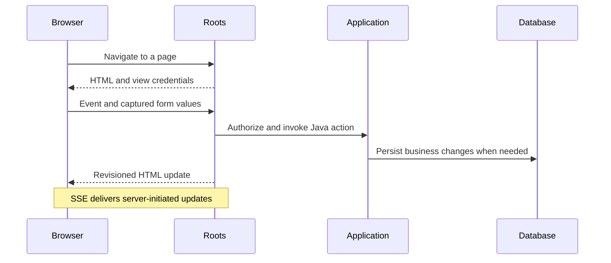

# Roots

**Server-rendered Java UI with stateful components and live updates.**

[](https://github.com/chaplinkyle/roots/actions/workflows/ci.yml)
[](docs/compatibility.md)
[](LICENSE)

Roots is a Java web framework for internal tools, administrative interfaces, and
business workflows. You write pages, layouts, components, and server actions in
Java. Roots renders HTML, keeps each live view's component objects on the server,
and updates the browser when their state changes.

The core has **no third-party runtime dependencies**. A packaged browser driver
handles navigation, events, and DOM updates. Ordinary applications need no Node,
npm, React, hydration step, or separate JavaScript application. CSS is ordinary
CSS; optional [browser widgets](docs/browser-widgets.md) integrate JavaScript
libraries through an explicit lifecycle and DOM ownership contract.

**Status: pre-release (`0.1.0-SNAPSHOT`).** Evaluate Roots in controlled pilots.
There is no stable API promise or production support commitment yet. Maven
coordinates are **not published to Maven Central**; build from source or use a
verified [candidate repository bundle](docs/releases.md).

## What Roots owns

| Framework | Application and deployment |
|---|---|
| Java component lifecycle and live-view state | Durable business records and transactions |
| Page/layout/API routing | Credential verification and user management |
| Server actions, validation binding, HTML patches | Business authorization rules |
| Session and CSRF integration, output escaping, CSP | TLS, trusted proxies, secrets, and operations |
| Optional JDBC, Servlet, and Spring adapters | Database schema, migrations, and capacity planning |

The Java namespace and Maven group are **`com.chaplin.roots`**. The core artifact
is `com.chaplin.roots:roots-core`. See the [project definition](docs/definition.md)
for the exact scope, execution model, and ownership boundaries.

## Quick start

Install JDK 25 or 26 and Git, then:

```bash
git clone https://github.com/chaplinkyle/roots.git
cd roots
./mvnw -pl examples/enterprise -am package -DskipTests
java -jar examples/enterprise/target/roots-enterprise-example-0.1.0-SNAPSHOT-app.jar
```

On Windows, replace `./mvnw` with `.\mvnw.cmd`. Open
[localhost:8080](http://localhost:8080). This UI showcase holds its customer list
in memory. The quick start skips tests; [contributor verification](CONTRIBUTING.md)
runs the complete suite.

To start your own application, follow the [Maven archetype guide](docs/archetype.md).
For persistence and login, start from one of the reference applications below.

## A page in Java

```java
package com.example.pages;

import com.chaplin.roots.PageContext;
import com.chaplin.roots.annotation.ServerAction;
import com.chaplin.roots.html.Node;
import static com.chaplin.roots.html.Html.*;

public final class Page implements com.chaplin.roots.Page {
    private int count;

    @Override
    public Node render(PageContext context) {
        return main(
            h1("Count: " + count),
            button("Add one").onClick(this, "increment")
        );
    }

    @ServerAction
    private void increment() { count++; }
}
```

The `pages.Page` convention defines `/`. Each browser view receives its own
retained page instance. Clicking the button sends a request to Java; Roots runs
the action, renders the resulting tree, and reconciles the returned HTML.
The field is view state, so restarting the server resets it. Business data belongs
in a database.



## Fit and limits

Roots is a reasonable pilot fit for Java teams building CRUD tools, approval
flows, dashboards, and other connected business applications. Its main tradeoff
is keeping UI state on the server: interaction latency depends on the network,
and every active view consumes server resources.

- Live views belong to one JVM. Shared JDBC sessions do **not** provide component
  failover. Multiple instances require owner routing and recovery planning.
- Interactive pages require the packaged browser driver and a live connection.
  Offline-first apps and highly interactive browser editors need another model
  or carefully scoped widgets.
- Rendering may reevaluate the full Java tree even when the transferred DOM patch
  is scoped to one component. Remote requests are not local React updates.
- A timed-out response does not undo a database commit. Applications need durable
  recovery or idempotency for important mutations.
- Automated tests cover Chrome, Edge, and Firefox. Safari certification, manual
  assistive-technology review, and production capacity validation remain open.

See [production readiness](docs/production-readiness.md),
[security](SECURITY.md), and [measured workload limits](docs/load-testing.md).

## Reference applications

| Example | Purpose | Persistence |
|---|---|---|
| [UI showcase](examples/enterprise) | Components, forms, navigation, overlays, widgets | In memory |
| [Chat](examples/chat/README.md) | Multiple live views and server-pushed updates | In memory |
| [Automation](examples/automation/README.md) | Authenticated APIs, webhooks, durable receipts | PostgreSQL |
| [Customer workflow](examples/workflow/README.md) | Login/OIDC, drafts, validation, concurrent edits | PostgreSQL |
| [Kanban](examples/kanban/README.md) | Task board, drag/drop, archive, activity history | PostgreSQL |
| [Servlet](examples/servlet/README.md) | Existing Jakarta Servlet containers | Demonstration only |

Examples are separate applications, not dependencies of `roots-core`. Deployment
recipes are under [deploy/](deploy/README.md). Templates and local tests do not
establish that a cloud deployment has been executed.

## Documentation

- [Definition and design boundaries](docs/definition.md)
- [Application guide and API examples](docs/guide.md)
- [Routing and component conventions](docs/conventions.md)
- [Implemented feature contracts](docs/feature-contract.md)
- [Architecture](docs/architecture.md) and [browser protocol](docs/protocol.md)
- [JDBC](docs/jdbc.md), [Spring/Servlet integrations](docs/integrations.md), and [machine APIs](docs/automation.md)
- [Compatibility and namespace migration](docs/compatibility.md)
- [Release process](docs/releases.md), [changelog](CHANGELOG.md), and [roadmap](docs/roadmap.md)

## Contributing

Read [CONTRIBUTING.md](CONTRIBUTING.md). Public behavior needs documentation,
Java tests, and browser evidence where applicable. Report suspected
vulnerabilities through [private security reporting](SECURITY.md).

Licensed under [Apache License 2.0](LICENSE).
