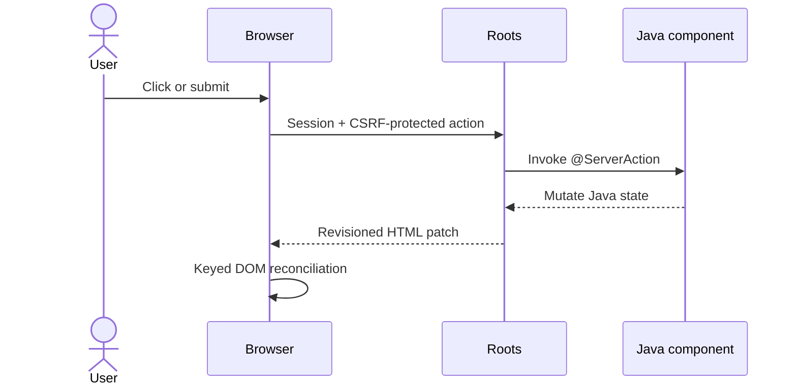

# Roots application guide

Detailed examples for the current pre-release API. Start with the [project definition](definition.md) and [quick start](../README.md#quick-start).

## A live Java component

```java
@ViewComponent("approval-counter")
public final class ApprovalCounter implements Component {
    private final State<Integer> approved = State.of(0);
    private final Ref approveButton = Ref.create();

    @Override
    public Node render(PageContext context) {
        return section(
            strong(approved.get()),
            button("Approve next")
                .type("button")
                .ref(approveButton)
                .optimistic(
                    OptimisticEffect.text(approveButton, "Approving..."),
                    OptimisticEffect.disable(approveButton)
                )
                .onClick(this, "approve")
        ).pendingScope();
    }

    @ServerAction
    private void approve() {
        approved.update(count -> count + 1);
    }
}
```

Keep a stateful component in a page field so its Java identity survives live
rerenders:

```java
@PageMetadata(
    title = "Operations",
    description = "The JVM is the full stack.",
    stylesheets = "/app.css",
    canonical = "https://operations.example.com/",
    robots = "index, follow",
    themeColor = "#17324d",
    openGraphType = "website",
    openGraphImage = "https://operations.example.com/share.png",
    openGraphImageAlt = "Operations dashboard"
)
public final class Page implements com.chaplin.roots.Page {
    private final ApprovalCounter approvals = new ApprovalCounter();

    @Override
    public Node render(PageContext context) {
        return main(h1("Operations"), approvals);
    }
}
```

No controller, client store, JSON DTO, hook rule, or event script is required.

## Static pages and incremental regeneration

Public, deterministic pages can opt into build-time HTML generation. A positive
interval serves stale HTML while exactly one virtual-thread regeneration runs:

```java
@Prerender(revalidateSeconds = 300)
@PageMetadata(title = "Product catalog")
public final class Page implements com.chaplin.roots.Page {
    @Override
    public Node render(PageContext context) {
        return main(h1("Catalog"), catalog.readOnlySummary());
    }
}
```

Dynamic routes provide concrete build paths in Java with
`@Prerender(paths = ProductPaths.class)`, where `ProductPaths` implements
`StaticPathProvider`. The `roots-maven-plugin` runs after compilation and packages
the generated manifest and HTML in the application JAR. Generated responses are
session-free, include SHA-256 ETags, support `HEAD` and `304`, and contain neither
the Roots browser runtime nor live-view tokens.

Prerendering is intentionally for public content. Roots rejects pages with page
or layout authorization, server actions, session mutation, portals, or async
components. Static responses bypass application middleware just like public
assets, so never use `@Prerender` on personalized or protected content.

## How rerendering works



The server remains authoritative. Browser actions are serialized per live view,
and monotonically increasing revisions prevent older responses from overwriting
newer state. Background work can run on virtual threads and push patches through
Server-Sent Events. Roots assigns deterministic render-occurrence boundaries to
components whose root is one HTML element. After an action, it proves that the
old full HTML becomes the new full HTML by replacing exactly one boundary, then
sends the narrowest valid region. Changes outside a component, fragment-root
components, portals, structural ambiguity, and queued background updates use a
full-root patch. A patch whose base revision does not match the browser reloads
instead of risking an invalid partial update.

## What is implemented

| Area | Available today |
|---|---|
| Components | composition, record props, retained `State<T>`, keyed lists |
| Events | delegated click, double-click, submit, change, input, keyboard, focus, blur, and pointer bindings with typed metadata |
| Rendering | escaped HTML tree, fragments, conditional/list rendering, exact component-scoped patches with safe root fallback, unsafe escape hatch |
| Lifecycle | mount/unmount callbacks, typed context, dependency-keyed memoization |
| Resilience | error boundaries, typed exception mapping, accessible field-validation binding, stale-revision rejection, bounded async patch queue |
| Async UI | virtual-thread loaders, fallback UI, failure UI, SSE patches |
| Browser effects | refs, focus/blur, editable-text selection, scroll-into-view, clipboard, accessible polite/assertive announcements |
| Optimistic UI | typed hide, text, value, and disable effects with automatic failure rollback |
| Pending UI | nearest nested pending scopes with CSS hooks and accessible busy state |
| View transitions | typed action and opt-in link commits with ordered, reduced-motion-aware fallback |
| Portals | Java-owned body-level overlays plus native accessible modals with focus containment, Escape/backdrop actions, and focus return |
| Routing | package pages, nested layouts, dynamic/catch-all routes, `@Route` overrides, compile-time manifest and collision diagnostics |
| Framework | metadata annotations and local web fonts, responsive image optimization, API routes with lazy file/fixed/chunked responses and HEAD semantics, typed record form binding and extensible validation constraints, strict request/response cookies, build-time static pages/ISR, multipart forms/files, tagged data cache, conditional static assets, sessions, typed middleware, instance-factory SPI, Spring Boot starter, client navigation |
| Operations | bounded admission, thresholded request-body spooling, deterministic request/view disposal, readiness health, graceful drain, W3C trace propagation, structured completion events, runtime counters, optional Actuator/Micrometer bridge |
| Tooling | Maven archetype, compile-time route processor, prerender Maven plugin, clean-compile source watcher, isolated classloader restart, browser reload/error overlay, live component/action inspector, executable-JAR examples, coverage gates, bounded HTTP load tests with an opt-in soak profile, real Chrome + Edge + Firefox contracts, and test-only automated WCAG 2.2 AA/best-practice audits |
| Compatibility | committed core and adapter public-API signature baselines, explicit versioned browser/server protocol, rolling-deployment reload negotiation |
| Security baseline | output escaping, centrally enforced configurable CSP, validated bounded cookie syntax and prefix invariants, HttpOnly/SameSite cookies, opt-in `Secure`/partitioned cookies, CSRF binding, named authorization policies, configurable request limit (1 MiB default) |

See the exact [React and Next.js feature contract](../docs/feature-contract.md) for
implemented, partial, and planned capabilities.
The supported surface and release rules are in [Compatibility policy](../docs/compatibility.md),
and the live wire schema is in [Browser protocol](../docs/protocol.md).

## Streaming API responses

API routes can send large exports, generated archives, media, or files without
first allocating one response-sized byte array:

```java
@Override
public Response get(Request request) throws IOException {
    return Response.file(200, "text/csv; charset=utf-8", exportPath)
            .withHeader("Content-Disposition", "attachment; filename=customers.csv");
}
```

Use `Response.stream(status, contentType, exactLength, writer)` when the byte
count is known, or the overload without a length for transport streaming
framing. The writer runs synchronously only when the body is sent, must close any
input or application resource it opens, and must not close the supplied output.
Fixed-length writers are rejected if they produce too few or too many bytes.
`HEAD` delegates to `get` by default, sends known representation metadata, and
never invokes the writer; override `head` when constructing the GET response is
itself expensive. Both the built-in listener and Jakarta Servlet adapter share
this contract.

Every API route also handles `OPTIONS` automatically. Roots derives a canonical
`Allow` header from the Java methods the route overrides, treats `GET` as also
supporting its default body-free `HEAD`, and attaches that same header to `405`
responses. Override `options` when the application needs additional response
metadata such as an explicitly reviewed CORS policy; Roots does not guess allowed
origins or credential rules.

## Browser events

Roots delegates eleven validated event types from its small browser runtime:
`click`, `dblclick`, `submit`, `change`, `input`, `keydown`, `keyup`, `focus`,
`blur`, `pointerdown`, and `pointerup`. Fluent Java methods cover each event, and
one annotated handler can be reused across multiple event types.

```java
input()
    .name("query")
    .onInput(this, "search")
    .debounceInput(java.time.Duration.ofMillis(150))
    .onKeyDown(this, "keyboardShortcut");

@ServerAction
private void keyboardShortcut(ActionEvent event) {
    if (event.browser().controlKey()
            && event.browser().key().filter("k"::equalsIgnoreCase).isPresent()) {
        // Update ordinary Java component state.
    }
}
```

`event.browser()` exposes a `BrowserEvent.Type`, optional key/code, Alt/Control/
Meta/Shift state, optional pointer button, and bounded viewport coordinates.
Metadata is snapshotted when the DOM event occurs and validated again at the HTTP
boundary. Unsupported event names fail during render instead of silently doing
nothing. Framework-directed focus restoration and typed focus effects are
suppressed from the server-action listener, preventing recursive focus actions.
Use `debounceInput(Duration)` for searches that should send the latest value after
a quiet interval, or `onChange` when an interaction should commit after editing.
Pending input flushes before a click or submit. Form values are captured when
events occur, and newer unsent edits survive older responses and unrelated SSE
updates. The browser bounds pending work and reports saturation through
`roots:backpressure` and `roots:error`; measure high-frequency actions under load.

## Middleware, authorization, and dependency injection

`Middleware` wraps application page, API, action, and authenticated disposal
requests. Public assets, the Roots browser runtime, readiness health, and
unmatched paths intentionally bypass it and do not allocate sessions. A
validated live action exposes its originating page as `request.path()` and the
internal endpoint as `request.transportPath()`, so route guards are reapplied to
server actions instead of protecting only the initial HTML request.

```java
var config = RootsConfig.forApplication(Application.class)
        .use((request, chain) -> {
            var authorized = request.session().get("principal").isPresent();
            if (request.path().startsWith("/admin") && !authorized) {
                return request.header("Accept").orElse("").contains("application/json")
                        ? Response.json(403, "{\"error\":\"Forbidden\"}")
                        : Response.text(403, "Forbidden");
            }
            return chain.next();
        })
        .instanceFactory(type -> applicationContainer.create(type))
        .sessionTimeout(Duration.ofHours(8))
        .viewTimeout(Duration.ofMinutes(30))
        .maxConcurrentRequests(20_000)
        .maxLiveViews(10_000)
        .maxSessions(100_000)
        .sessionRepository(SessionRepository.inMemory())
        .liveViewOwnership(LiveViewOwnership.inMemory("orders-node-1"))
        .maxRequestBytes(8 * 1024 * 1024)
        .requestBodyMemoryThreshold(64 * 1024)
        .maxMultipartTextFieldBytes(1024 * 1024)
        .requestBodyTemporaryDirectory(Path.of("/var/tmp/roots"))
        .cache(RootsCache.inMemory(50_000))
        .contentSecurityPolicy("default-src 'self'; script-src 'self'; "
                + "style-src 'self'; connect-src 'self'; object-src 'none'; "
                + "base-uri 'self'; frame-ancestors 'none'; form-action 'self'")
        .secureCookies(true)
        .build();
```

The instance factory constructs convention-discovered pages, layouts, and API
routes, allowing a DI container to perform constructor injection. `secureCookies`
should be enabled when the browser reaches Roots through HTTPS. The built-in
server also exposes `application.runtimeSnapshot()` for request, session, and
live-view counts.

`SessionRepository` owns atomic creation, idle refresh, expiry, and capacity.
The default is bounded and node-local. An application can provide a durable or
distributed implementation; it may return a `Session` subclass whose value
methods delegate to its external store. Repository availability failures become
session-free `503` responses. Spring Boot automatically uses a unique
`SessionRepository` bean. This makes session identity and values pluggable, but
does not move live component object graphs between nodes.

`LiveViewOwnership` owns the separate node-affinity lease for each live view.
The default generates a secure process-local node identifier. A clustered
application can provide shared lease storage; Roots then advertises
`X-Roots-Node`, reports a session-matched wrong node with `X-Roots-Owner`, renews
leases during live activity, and releases them on every cleanup path. Spring Boot
automatically uses a unique `LiveViewOwnership` bean. This makes affinity
observable and routable, but component graphs remain deliberately node-local.
The optional `roots-jdbc` artifact supplies standard-JDBC session, distributed
cache, and ownership implementations plus safe scalar value codecs; see
[JDBC shared state](../docs/jdbc.md) for schema, configuration, clock,
pool, and deployment requirements.

Roots sends its restrictive default Content Security Policy on every HTML
response, including static HTML, application `Response.html(...)` results,
mapped HTML errors, framework pages, and 404s. Use `contentSecurityPolicy(...)`
only when an application deliberately needs additional origins. Policies are
trimmed, capped at 8,192 characters, and reject control characters to prevent
header injection. A response-local CSP cannot bypass the configured policy.

`AuthenticationProvider` is the transport-neutral authentication boundary. The
default preserves an identity supplied by a Servlet/container adapter. Embedded
JDK-server applications can resolve session cookies, signed credentials, or strict
Bearer tokens in ordinary Java:

```java
var bearer = AuthenticationProvider.bearer(token -> tokenService.verify(token)
        .map(account -> AuthenticatedIdentity.of(account.username(), account.authorities())));

var config = RootsConfig.forApplication(Application.class)
        .authenticationProvider(bearer)
        .build();
```

The Bearer adapter accepts one unambiguous RFC 6750 credential, bounds it at 8,192
characters, and invokes application verification only after syntax validation.
Missing, duplicate, unsupported, and malformed credentials remain anonymous.
Providers rerun for initial pages, APIs, actions, streams, and the development
inspector. Spring Boot automatically discovers a unique application-owned
`AuthenticationProvider` bean.

Named policies make authorization declarative without prescribing a user store.
Every request exposes `Optional<AuthenticatedIdentity>` through
`Request.identity()`, `PageContext.identity()`, and `ActionEvent.identity()`.
The identity contains only an immutable principal name and exact granted-authority
strings; credentials and provider-specific principal objects never enter a live
view. Names, individual authorities, and the authority collection are bounded and
control characters are rejected before identity data can be retained. Annotate a
page, nested layout, API route, or server-action method:

```java
@Authorize("staff")
public final class Page implements com.chaplin.roots.Page {
    @Authorize("customer.write")
    @ServerAction
    private void approve(ActionEvent event) {
        // Runs only after both policies allow this action.
    }
}
```

Register each policy when building the application:

```java
var config = RootsConfig.forApplication(Application.class)
        .authorize("staff", AuthorizationPolicy.role("STAFF",
                Response.json(403, "{\"error\":\"Forbidden\"}")))
        .authorize("customer.write", request -> authorization.canWrite(
                        request.session(), request.parameters().get("customerId"))
                ? AuthorizationPolicy.allow()
                : AuthorizationPolicy.deny(
                        Response.json(403, "{\"error\":\"Forbidden\"}")))
        .build();
```

Layout policies apply to descendant pages. Page/layout policies run on initial
render, every action, and SSE connection/activity; method policies run immediately
before mutation. Dynamic route parameters and the logical page path are available
when actions are checked. Missing route policies fail startup, unknown bound-action
policies fail rendering, and every denial is `no-store`. Roots supplies the
authentication/authorization boundaries, not token signing, password handling,
login UI, or a user database. A live view is bound to the
identity that created it; a changed principal name or authority set expires the
view before an action, SSE attachment, or inspector request can reuse it.

## Health, limits, and graceful shutdown

`GET /_roots/health` is a session-free readiness endpoint that exposes status,
readiness, and the local ownership node identifier. It bypasses application middleware so infrastructure probes
cannot fill the session store or fail behind an application login redirect.
Detailed handled/rejected/active request, view, session, peak, and limit counters
remain available through `application.runtimeSnapshot()` for application-owned,
authenticated metrics publication.

Classpath resources under `public`, `/_roots/client.js`, and unmatched requests
are also session-free, so cache hits and scanner traffic cannot consume session
capacity. Production assets include a SHA-256 `ETag`, support conditional
`If-None-Match` requests with an empty `304` response, and are cached in memory.
Development mode reloads public resource bytes and sends `Cache-Control: no-store`.

## Optimized images and local fonts

Roots generates responsive image markup and transforms local PNG/JPEG assets with
the JDK's own Image I/O pipeline—there is no image library or remote fetcher:

```java
image("/images/hero.jpg", "Team reviewing a release", 1200, 800)
    .widths(320, 640, 960, 1200)
    .sizes("(max-width: 700px) 100vw, 1200px")
    .quality(82)
    .priority()
    .className("hero");
```

The rendered `src` and `srcset` use the session-free `/_roots/image` endpoint.
It accepts only root-relative files under `public`, detects the actual format,
never upscales, preserves PNG alpha, and bounds source bytes, decoded pixels,
output dimensions, responsive candidates, and its production LRU. Production
responses carry SHA-256 ETags and one-day browser caching; development always
re-reads the source and sends `no-store`. SVG, GIF, WebP, AVIF, animation, and
remote URL transformation are intentionally not claimed.

Declare same-origin fonts with page metadata. Roots emits a cacheable generated
`@font-face` stylesheet and optionally a synchronized preload link:

```java
@PageMetadata(
    title = "Customers",
    stylesheets = "/app.css",
    fonts = @PageFont(
        family = "Roots Sans",
        source = "/fonts/roots.woff2",
        weight = "100 900",
        preload = true
    )
)
```

Dynamic metadata can use
`Metadata.of("Customers", "Manage accounts", "/app.css").withFonts(WebFont.of("Roots Sans", "/fonts/roots.woff2").preloaded())`.
Override `headMetadata(PageContext)` with immutable `HeadMetadata` and
`OpenGraphMetadata` records for route- or state-dependent canonical, robots,
theme-color, and social-preview values. Roots escapes and validates URL-bearing
values, renders them during live and static generation, and replaces or removes
the framework-managed tags after actions and client navigation.
Layouts can implement the same `headMetadata` method for shared values. Nested
layout declarations merge outermost to innermost, then the page overrides them
field by field, including individual Open Graph fields.
WOFF2, WOFF, TTF, and OTF remain ordinary public assets; decoding and glyph
rendering stay in the browser. Image URLs, source sets, font stylesheets, and
preloads are automatically rebased for Servlet context and mapping paths and are
also safe in prerendered documents.

The default per-JVM limits are 20,000 executing requests, 10,000 live views, and
100,000 sessions. Request bodies are limited to 1 MiB by default and oversized
bodies return `413`. Capacity rejection returns `503`, `Retry-After: 1`, and does
not exceed the configured permit. Long-lived SSE connections count as executing
requests, so `maxConcurrentRequests` must exceed `maxLiveViews` to preserve room
for actions when every view has a stream. Tune all limits from measured heap use
and traffic rather than treating the defaults as a sizing recommendation.

For a two-phase deployment shutdown:

```java
application.beginDrain(); // readiness becomes 503; new work is rejected
application.closeGracefully(Duration.ofSeconds(30)); // accepted work may finish
```

`closeGracefully` releases `await()` callers after shutdown. Plain `close()`
remains the immediate-shutdown form.

## Tracing and request observations

Every transport request accepts a W3C `traceparent` header. Roots continues a
valid trace with a fresh server span, safely starts a new trace for invalid input,
and exposes the immutable `TraceContext` through `Request`, `PageContext`, and
`ActionEvent`. For direct browser and test correlation, every response also
contains the current server `traceparent` value.

Register completion observers without adding a logging or telemetry dependency
to the core:

```java
var config = RootsConfig.forApplication(Application.class)
        .observeRequests(RequestObserver.structured())
        .observeRequests(observation -> telemetry.record(observation))
        .build();
```

Each observer receives exactly one immutable `RequestObservation` after the
exchange closes, including long-lived streams. It contains trace IDs, monotonic
duration, method, logical and transport paths, status, outcome, and actual bytes
written. Headers, query values, bodies, form values, cookies, and credentials are
deliberately absent. Observer failures cannot alter the response or prevent later
observers from running. `RequestObserver.structured()` writes one stable JSON
object per line through the JDK logging API. OpenTelemetry span creation and
export remain application-owned and can be implemented as another observer.

## Request and response cookies

API routes and middleware read validated application cookies without parsing raw
headers. Malformed pairs are ignored and the first occurrence of a duplicate name
wins:

```java
var theme = request.cookie("theme").orElse("system");

return Response.noContent().withCookie(
        ResponseCookie.builder("theme", "dark")
                .httpOnly(false)
                .maxAge(Duration.ofDays(365))
                .build()
);
```

`ResponseCookie` defaults to `Path=/`, `HttpOnly`, and `SameSite=Lax`; `Secure`
is explicit so local HTTP development works. It validates bounded RFC 6265
cookie-octet values, absolute paths, normalized ASCII domains,
`SameSite=None`/partition security requirements, and `__Secure-`, `__Host-`,
`__Http-`, and `__Host-Http-` prefix invariants. Values are not silently encoded;
use a cookie-safe representation such as unpadded URL-safe Base64 when arbitrary
bytes are required. Repeated calls to `Response.withCookie(...)` produce separate
`Set-Cookie` fields.

Live Java UI reads the initial or latest action-request snapshot through
`PageContext.cookie(...)`. Actions use `ActionEvent.cookie(...)` and can attach up
to 32 response cookies after successful execution:

```java
@ServerAction
private void rememberDensity(ActionEvent event) {
    event.setCookie(ResponseCookie.builder("density", "compact")
            .path(event.cookiePath())
            .httpOnly(false)
            .secure(event.connection().scheme().equals("https"))
            .build());
}
```

`cookiePath()` returns `/` at the origin root and the exact application mount
under Servlet deployment. `deleteCookie(name)` expires a host-only cookie at that
path; use an explicit expiration builder when Domain or Partitioned attributes
must match. Cookies queued by an action are discarded if the action or its
authoritative rerender fails. Cookie contents are also deliberately excluded from
structured request observations.

## Exceptions and validation

Application exception types can be converted to HTTP responses without leaking
transport concerns into pages or services:

```java
var config = RootsConfig.forApplication(Application.class)
        .mapException(CustomerNotFound.class, (request, failure) ->
                Response.json(404, "{\"error\":\"Customer not found\"}"))
        .build();
```

Throw `ValidationException` from an action or route to return a `422` JSON body
with an `error` message and immutable, field-keyed `fields` arrays. Roots JSON
escapes markup-sensitive characters and marks mapped and validation responses
`Cache-Control: no-store`. Exception mappers run in declaration order.

Live forms can opt into accessible validation rendering without application
JavaScript. Match a control's `name` with `validationMessage`, and put one
`validationSummary` in the form:

```java
form(
    label("Email", input().type("email").name("email")),
    validationMessage("email"),
    validationSummary(),
    button("Save").type("submit")
).onSubmit(this, "save");

@ServerAction("save")
private void save(ActionEvent event) {
    var form = event.bind(ContactForm.class);
    contacts.save(form.email(), form.age());
}

@FormModel(message = "Check the highlighted fields.")
record ContactForm(
    @FormField(trim = true)
    @NotBlank(message = "Enter an email.")
    @Email String email,
    @Min(18) @Max(120) int age
) {}
```

`ActionEvent.bind(...)` and `Request.bind(...)` compile and cache record metadata,
convert submitted values, aggregate every field failure, and reuse the existing
bounded `ValidationException` response. Supported components include strings,
booleans, numeric types, enums, UUIDs, common `java.time` values,
`Optional<T>`, `List<T>`, `UploadedFile`, and repeated uploads. `@FormField`
maps or trims input; `@NotBlank`, `@Email`, `@Size`, `@Min`, and `@Max` provide
JDK-only constraints. Applications can create reusable annotations with
`@FormConstraint` and a stateless `ConstraintValidator`—Jakarta Validation is
not required or embedded.

For a structured `422`, the driver rolls back optimistic changes, writes messages
as text, exposes the summary as an alert, and adds `aria-invalid` plus
`aria-describedby` to matching controls. Editing a field restores its exact prior
ARIA/message state; the next action clears the form's previous validation. Expected
validation emits `roots:validation`, not `roots:error`. Payloads are bounded to 128
fields, 16 messages per field, 256 messages total, and 2,048 characters per message.

## Forms and file uploads

Add a normal file input to a live form. The Roots browser driver automatically
uses browser-native `FormData` when a file is selected, while forms without files
keep the smaller URL-encoded transport.

```java
form(
    input().type("file").name("attachment"),
    button("Upload").type("submit")
).onSubmit(this, "upload");

@ServerAction
private void upload(ActionEvent event) throws IOException {
    var file = event.file("attachment")
            .orElseThrow(() -> new ValidationException(
                    "Choose a file", Map.of("attachment", List.of("Required"))));
    try (var content = file.openStream()) {
        documentStore.save(content, file.size(), file.contentType());
    }
}
```

API routes use the same `request.file("attachment")` and repeated
`request.files("attachment")` APIs. Multipart parsing is JDK-only, binary-safe,
bounded by `maxRequestBytes`, and limited to 256 parts. Request bodies stay in
heap only through the configured threshold (64 KiB by default), then spool to a
request-scoped file in the configured temporary directory. Multipart files are
repeatable zero-copy slices of that body; `openStream()` avoids materializing a
large upload, while `content()` intentionally creates a byte array. Roots deletes
the temporary body after the synchronous middleware/route/action pipeline on
both success and failure. Use `transferTo(...)` or consume `openStream()` before
returning when accepted content must outlive the request. Individual text parts
have a separate 1 MiB default cap. `UploadedFile.filename()` is untrusted client
metadata: display it only through escaped nodes and never resolve it directly as
a filesystem path.

## Typed browser effects

Server actions can request a bounded set of browser capabilities without adding
application JavaScript or creating a second client-side state model:

```java
private final Ref customerName = Ref.create();

@ServerAction
private void editCustomer(ActionEvent event) {
    event.selectText(customerName);
    event.announce("Customer is ready to edit");
}

@ServerAction
private void cancelEdit(ActionEvent event) {
    event.blur(customerName);
    event.announceAssertively("Editing cancelled");
}
```

The Java-owned effects are focus, blur, editable-text selection, scroll into
view, clipboard copy, polite/assertive accessibility announcements, and view
transitions. Missing or unsupported browser targets are safe no-ops; the
authoritative server patch still commits. Framework-directed focus and blur are
suppressed from action listeners so they cannot recursively invoke bound focus
or blur actions.

Live documents contain permanent polite and assertive ARIA live regions outside
the reconciled application root. Roots writes announcement values as text,
serves their visually-hidden style from the same-origin `/_roots/client.css`
asset for strict CSP deployments, and emits `roots:announce` with the message
and priority for observability and testing. Announcement text is nonblank and
limited to 2,048 characters; clipboard text is limited to 16,384 characters.
Arbitrary script execution is intentionally not part of the effect API.

## Optimistic actions

An action element can declare bounded, typed browser effects without embedding
application JavaScript. Capture the target with a `Ref`, then opt into one or
more reversible mutations:

```java
private final Ref saveButton = Ref.create();

button("Save")
    .ref(saveButton)
    .optimistic(
        OptimisticEffect.text(saveButton, "Saving..."),
        OptimisticEffect.disable(saveButton)
    )
    .onClick(this, "save");
```

Roots captures form values before applying `HIDE`, `TEXT`, `VALUE`, or `DISABLE`.
A successful server render remains authoritative and replaces the temporary DOM
state. A non-2xx response, transport failure, or patch failure restores effects
in reverse order before emitting `roots:error`. Targets may live in the main tree
or a portal. Each action element is limited to 32 effects, and optimistic effects
require a server action on that same element.

## View transitions

A server action can progressively enhance its authoritative DOM commit with the
browser View Transition API—still entirely from Java:

```java
@ServerAction
private void reorder(ActionEvent event) {
    customers.sort(Comparator.comparing(Customer::name));
    event.viewTransition();
}
```

Roots waits for the transition update callback before it releases the pending
boundary or starts the next action for that view. Browsers without
`document.startViewTransition`, and users whose system requests reduced motion,
receive the exact same revisioned patch synchronously without animation. Style
the standard `::view-transition-old(root)` and `::view-transition-new(root)`
pseudo-elements in application CSS when custom timing is wanted. The request is
a typed, target-free `ClientEffect`; duplicate calls in one action collapse to
one transition and all action effects share a hard limit of 32.

Client navigation uses the same progressive commit path when a Java link opts in:

```java
link("/customers", "Customers").viewTransition();
```

Fetch and parsing finish before the transition begins; root replacement,
stylesheets, metadata, history, portal synchronization, and the navigation event
then commit together inside the transition update callback.

Navigation is latest-wins when users click quickly. Roots disposes the unused live
view from a late older response, and every action, redirect, reconnect, and SSE
patch is checked against the active view before it can mutate the DOM or navigate.
The browser also captures an action's view when the event is queued, so validation,
authorization, protocol, and transport failures cannot reload or bind errors to a
newer page, and queued old-page actions are never sent with new-page credentials.
Rejected expected races emit `roots:stale` with diagnostic `kind` and `view`
detail; applications do not need to reconcile them.

Fragment navigation follows browser expectations. A link within the current
path/query stays native, scrolls without fetching, and does not allocate another
live view. A fragment on a different Roots route commits the destination and then
scrolls to its decoded `id` or `name`. Roots records scroll coordinates in its
history entries and restores them on back/forward traversal. Cross-route text
fragments retain a full browser navigation because their matching algorithm is
browser-owned. Internal `ActionEvent.redirect(...)` destinations use the same
client-navigation path, including fragments and requested view transitions.

## Scoped pending boundaries

Call `.pendingScope()` on any element to make it the nearest pending boundary for
actions below it. Roots temporarily adds `data-roots-pending="true"` and
`aria-busy="true"`; ordinary CSS can reveal status UI or transition the region:

```java
section(
    customerTable,
    span("Refreshing...").className("pending-message"),
    button("Refresh").onClick(this, "refresh")
).pendingScope();
```

```css
.pending-message { visibility: hidden; }
[data-roots-pending="true"] .pending-message { visibility: visible; }
```

Scopes nest, and only the closest scope enters pending state. The previous
`aria-busy` and pending attributes are restored exactly after success or failure.
The scope can live inside a portal. Roots also retains the global
`html[data-roots-pending="true"]` hook and `#roots[aria-busy="true"]` for an
application-wide progress bar. No application JavaScript is involved.

## Data caching and revalidation

Every application has one bounded cache shared by pages, API routes, actions,
and application jobs. Reads with the same key are coalesced, so concurrent misses
invoke the loader once instead of stampeding a database.

```java
var customers = context.cache().get(
        "customers:active",
        List.class,
        CachePolicy.tagged(Duration.ofMinutes(5), "customers"),
        customerRepository::findActive
);
```

API routes use `request.cache()` and live actions use `event.cache()`. A mutation
or background job can invalidate a key or a whole domain through
`event.cache().invalidateTag("customers")` or
`application.cache().invalidateTag("customers")`. The default cache retains at
most 10,000 in-process values, expires entries lazily, evicts least-recently-used
values at capacity, and exposes hit/miss/load/eviction counters through
`cache.snapshot()`.

Configure another capacity with `.cache(RootsCache.inMemory(maxEntries))`, disable
caching for a test, or provide a `RootsCache` implementation backed by application
infrastructure. The built-in implementation is node-local; it does not make
multi-node invalidation distributed.

Multi-node applications can use the optional `roots-jdbc` adapter. It shares
entries, TTLs, key/tag invalidations, and miss ownership through the application's
`DataSource`; a database lease recovers abandoned loaders and a generation check
prevents an overlapping invalidation from publishing stale data:

```java
JdbcRootsCache.createSchema(dataSource); // test/first-run tooling only

var cache = new JdbcRootsCache(dataSource);
var config = RootsConfig.forApplication(Application.class)
        .cache(cache)
        .build();
```

The default JDBC codec supports safe scalar values without Java serialization.
Supply a thread-safe, versioned `JdbcCacheValueCodec` for records or collections,
and install `schemaStatements()` through the application's normal migration tool.

## Portals and overlays

`Html.portal` keeps overlay state and behavior in Java while mounting its rendered
content outside `#roots`, where it is not constrained by page stacking or overflow
contexts. For dialogs, `Html.modal` adds a labeled native-modal contract while the
open/closed state and dismiss action remain authoritative Java state.

```java
return fragment(
    button("Open").onClick(this, "open"),
    open ? modal(
        "customer-editor",
        "Edit customer",
        this,
        "close",
        p("Update the customer record."),
        button("Close").ref(closeButton).onClick(this, "close")
    ).initialFocus(closeButton).className("customer-dialog") : null
);

@ServerAction
private void open(ActionEvent event) {
    open = true;
}

@ServerAction
private void close() {
    open = false;
}
```

Portal IDs must be unique in a render and portals cannot be nested. Children are
server-rendered into an inert template, then the dependency-free Roots driver
mounts and reconciles a stable `[data-roots-portal-host]` under `body`. Components,
forms, annotated actions, lifecycle callbacks, and refs work across that boundary.
`Modal` always emits a visible heading wired through `aria-labelledby`, promotes
the dialog with `showModal()`, focuses an explicit `Ref` or the first usable
control, wraps Tab and Shift+Tab inside the topmost modal, prevents native Escape
from closing ahead of server state, and restores the still-connected opener only
after the authoritative render removes the modal. Escape always invokes the
dismiss action. Backdrop dismissal is enabled by default and can be disabled with
`dismissOnBackdrop(false)`; a normal close button should still bind the same
action. Failed or rejected dismissals leave the dialog open. Applications remain
responsible for dialog copy, sizing, backdrop CSS, destructive-action confirmation,
and choosing a sensible initial focus target.

## Run the enterprise example

Requirements: JDK 25 LTS or newer. Maven is downloaded automatically by the wrapper.

**macOS / Linux**

```bash
./mvnw clean install
java -jar examples/enterprise/target/roots-enterprise-example-0.1.0-SNAPSHOT-app.jar
```

**Windows PowerShell**

```powershell
.\mvnw.cmd clean install
java -jar examples\enterprise\target\roots-enterprise-example-0.1.0-SNAPSHOT-app.jar
```

Open <http://127.0.0.1:8080>.

For the development loop, run the example from its module directory:

```powershell
cd examples\enterprise
..\..\mvnw.cmd compile exec:java@roots-dev
```

Editing `src/main/java` or `src/main/resources` triggers a clean Maven compile.
Successful builds restart the application on the same port and reload connected
browsers. Failed builds leave the immutable last-good application running and
show a text-only compiler diagnostic in the browser.

Development pages also show a small **Roots** button. Its authenticated inspector
reports the live route and revision, page/layout types, component tooling names
and identities, annotated action methods, authorization policies, and the DOM
events currently bound to each action. Press `Ctrl+Shift+.` to toggle it.

The `roots-core` package build produces the binary, source, and Javadoc JARs.
JDK doclint runs with warnings as build failures, so the published dependency's
public Java API remains navigable directly from an IDE.

The example is intentionally an external-style consumer of `roots-core`:

| Example | Demonstrates |
|---|---|
| [Operations page](../examples/enterprise/src/main/java/com/acme/pages/Page.java) | page metadata, nested components, sessions |
| [Approval counter](../examples/enterprise/src/main/java/com/acme/components/ApprovalCounter.java) | retained state, optimistic UI, scoped pending state, policy-protected actions, cache revalidation |
| [Support overlay](../examples/enterprise/src/main/java/com/acme/components/SupportOverlay.java) | retained portal state, dialog markup, actions, and cross-root focus |
| [Customer directory](../examples/enterprise/src/main/java/com/acme/pages/customers/Page.java) | forms, file uploads, accessible field validation, delegated live-search input, component props |
| [Latency chart](../examples/enterprise/src/main/java/com/acme/pages/latency/Page.java) | browser module lifecycle, accessible SVG, local range preserved across Java updates; no JS build step |
| [Dynamic customer page](../examples/enterprise/src/main/java/com/acme/pages/customers/$customerId/Page.java) | package-derived route parameters and dynamic metadata |
| [Activity page](../examples/enterprise/src/main/java/com/acme/pages/audit/Page.java) | annotation route override |
| [Health API](../examples/enterprise/src/main/java/com/acme/api/health/Route.java) | convention-based API route |
| [Metrics API](../examples/enterprise/src/main/java/com/acme/api/metrics/Route.java) | coalesced data caching and tag revalidation |
| [Integration test](../examples/enterprise/src/test/java/com/acme/ApplicationIntegrationTest.java) | real HTTP, sessions, actions, multipart forms, assets |

## Run the live chat example

Roots Relay is a shared chat room with no application-authored JavaScript. Build
it, start the executable JAR, and open two tabs:

```powershell
.\mvnw.cmd -pl examples/chat -am package
java -jar examples\chat\target\roots-chat-example-0.1.0-SNAPSHOT-app.jar
```

Messages submitted through `@ServerAction` mutate synchronized Java state and
rerender every connected view through Roots' built-in SSE patch channel. See the
[chat example guide](../examples/chat/README.md) for its features and deliberate
single-JVM boundaries.

The browser runtime exposes live-channel state as `data-roots-connection` on the
root element (`connecting`, `connected`, or `reconnecting`) and emits a
`roots:connection` event with `{ state }`. Offline transitions close the old
stream; the next authenticated stream supersedes its lease and starts with an
idempotent full snapshot, so updates that raced with a disconnect are recovered
without creating a second live view.

## Generate a new application

Until Roots artifacts are published to Maven Central, install this checkout once:

```bash
./mvnw install
```

Then generate a standalone application:

```bash
mvn archetype:generate \
  -DarchetypeGroupId=com.chaplin.roots \
  -DarchetypeArtifactId=roots-archetype \
  -DarchetypeVersion=0.1.0-SNAPSHOT \
  -DgroupId=com.example \
  -DartifactId=my-roots-app \
  -Dpackage=com.example \
  -DinteractiveMode=false \
  -DarchetypeCatalog=local
```

The generated project has one application runtime dependency:

```xml
<dependency>
  <groupId>com.chaplin.roots</groupId>
  <artifactId>roots-core</artifactId>
  <version>0.1.0-SNAPSHOT</version>
</dependency>
```

It also has the `roots-dev` artifact in Maven's `provided` scope, so development
tooling is available without entering the shaded production JAR. Start the
watcher from the generated project with:

```bash
mvn compile exec:java@roots-dev
```

See [the archetype guide](../docs/archetype.md) for complete Bash and PowerShell
commands.

## Jakarta Servlet deployment

`roots-core` includes the zero-dependency JDK listener used by generated apps.
For a standard Jakarta Servlet 6.1 container, add the separate adapter instead:

```xml
<dependency>
  <groupId>com.chaplin.roots</groupId>
  <artifactId>roots-servlet</artifactId>
  <version>0.1.0-SNAPSHOT</version>
</dependency>
```

Map `com.chaplin.roots.servlet.RootsServlet` to `/*`, enable async support, and name the
application anchor with init parameters:

```xml
<servlet>
  <servlet-name>roots</servlet-name>
  <servlet-class>com.chaplin.roots.servlet.RootsServlet</servlet-class>
  <async-supported>true</async-supported>
  <init-param>
    <param-name>roots.applicationClass</param-name>
    <param-value>com.example.Application</param-value>
  </init-param>
</servlet>
<servlet-mapping>
  <servlet-name>roots</servlet-name>
  <url-pattern>/*</url-pattern>
</servlet-mapping>
```

The adapter honors the web application's context path, uses container request and
response streams, runs SSE on Servlet async contexts backed by Java virtual
threads, and drains active exchanges when the servlet is destroyed. It has no
embedded Tomcat runtime dependency; Tomcat is used only to integration-test the
artifact. See [Integrations](../docs/integrations.md) for programmatic configuration
and current Spring Boot boundaries. By default it maps `getUserPrincipal()` to a
name-only Roots identity. Programmatic deployments can supply a
`ServletIdentityResolver` to add container-specific authorities; resolution occurs
before asynchronous handoff so SSE does not depend on thread-local security state.

## Routing conventions

| Java source | URL / behavior |
|---|---|
| `pages/Page.java` | `/` |
| `pages/customers/Page.java` | `/customers` |
| `pages/customers/$customerId/Page.java` | `/customers/{customerId}` |
| `pages/files/$$path/Page.java` | `/files/{*path}` |
| `pages/Layout.java` | wraps every descendant page |
| `pages/NotFound.java` | optional live root fallback for unmatched page URLs |
| `pages/ErrorPage.java` | optional safe live production fallback for failed page renders |
| `api/health/Route.java` | `/api/health` |
| `public/app.css` | `/app.css` |
| `@Route("/activity")` | overrides the derived route |

Packages beginning with `group_` organize routes without adding a URL segment.
Static underscores become hyphens. Generated applications mark their entry class
with `@RootsApplication`; `roots-processor` then validates routes and emits an
anchor-specific manifest during `javac`. Runtime classpath scanning remains the
fallback for applications that have not enabled the processor or that override
their convention packages. See [Conventions](../docs/conventions.md).

A concrete root `pages.NotFound` class is an ordinary Java `Page` with metadata,
layouts, components, state, and server actions, but its document response keeps
HTTP status `404`. Roots can commit that valid 404 document during client
navigation without reloading the browser. Unknown API routes and asset-like
requests keep the small, session-free framework 404 response. Do not annotate
the fallback with `@Route` or `@Prerender`.

A concrete root `pages.ErrorPage` handles otherwise-unmapped production failures
while rendering page documents. It receives the normal `PageContext`, including
the request trace ID, but never receives the exception or its potentially
sensitive message. It deliberately bypasses layouts and authorization so a
broken layout cannot break the fallback; render a complete accessible tree with
a `main` landmark. It retains HTTP status `500`, supports state and server
actions, and can commit during client navigation. Development diagnostics,
APIs, actions, validation failures, and configured exception mappers keep their
existing behavior. If `ErrorPage` fails, Roots uses its built-in safe 500 page.

## What can you realistically build?

Roots is currently a strong fit for:

- internal admin and back-office systems;
- CRUD applications and data directories;
- approval, review, and case-management workflows;
- operations consoles and live monitoring dashboards;
- small-team chat, activity feeds, and live collaboration rooms on one JVM;
- form-heavy intranet tools and customer portals;
- single-node SaaS prototypes and vertical product pilots.

It is not yet a good fit for multi-region stateless deployments, offline-first
PWAs, graphics-heavy editors, games, or internet-scale collaborative applications.
Those need a mature client runtime, distributed live-state model, or both.

## Spring and persistence

**Persistence libraries are compatible.** Roots places no restrictions on JDBC,
JPA/Hibernate, jOOQ, MyBatis, Flyway, Liquibase, HikariCP, or another normal Java
library. Put persistence behind application services and open transactions per
request/action; do not retain a non-thread-safe `EntityManager` in a live component.

**Spring Boot has a lifecycle-managed starter.** Add the starter and annotate the
Boot application class with the Roots convention anchor:

```xml
<dependency>
  <groupId>com.chaplin.roots</groupId>
  <artifactId>roots-spring-boot-starter</artifactId>
  <version>0.1.0-SNAPSHOT</version>
</dependency>
```

```java
@SpringBootApplication
@EnableRoots(Application.class)
public class Application {
    public static void main(String[] args) {
        SpringApplication.run(Application.class, args);
    }
}
```

The starter binds typed `roots.*` configuration, creates convention classes with
Spring constructor injection, starts after context refresh, and gracefully drains
before application services are destroyed. The default listener is
`127.0.0.1:8081`; set `roots.port=0` for an ephemeral test port. Define
`RootsConfigCustomizer` beans for middleware, policies, caches, or other builder
extensions. IDE configuration metadata is included in the artifact.

Forwarding headers are ignored by default. When Roots is behind a known reverse
proxy, list only that proxy's address ranges; optionally enable the bounded
node-local per-client limiter:

```properties
roots.trusted-proxies[0]=10.20.0.0/16
roots.trusted-proxies[1]=2001:db8:20::/48
roots.rate-limit-requests=300
roots.rate-limit-window=1m
roots.max-rate-limit-clients=100000
```

Roots strictly parses RFC `Forwarded` first, otherwise the conventional
`X-Forwarded-*` family, and walks the address chain from the nearest trusted
peer. Untrusted peers cannot override their client address, scheme, or authority.
`Request`, `PageContext`, and `ActionEvent` expose the resulting
`ClientConnection`. Rate limiting runs before body parsing and session allocation,
emits `RateLimit-*` headers, returns session-free `429` responses with
`Retry-After`, and excludes the health endpoint. A `ProxyPolicy` or `RateLimiter`
bean replaces the property-backed Boot implementation.

The compatibility default is `roots.transport=jdk`. In a Spring Boot Servlet web
application, set `roots.transport=servlet` to use Boot's existing server. Roots
owns `/*` by default; set `roots.servlet-path=/roots` to coexist with Spring MVC
outside `/roots/*`. Servlet mode combines that prefix with
`server.servlet.context-path`, scopes its session cookie accordingly, and rebases
framework endpoints plus generated root-relative `href`, `src`, `action`,
`formaction`, and `poster` attributes. `roots.host` and `roots.port` do not create
a second listener. Selecting Servlet mode in a non-Servlet application fails fast.
The starter drains Roots before Boot waits for the Servlet container's active
requests. Keep `roots.shutdown-timeout` below Boot's shutdown phase timeout and
allow additional supervisor grace; live component graphs are still process-local.

If Spring Security is present in Servlet mode, the starter automatically maps an
authenticated `Authentication` name and its exact `GrantedAuthority` strings into
Roots. Configure the normal `SecurityFilterChain`, then use
`AuthorizationPolicy.authenticated(...)`, `.authority(...)`, or `.role(...)` in
named Roots policies. Applications may override this by defining a
`ServletIdentityResolver` bean.

When Spring Boot Actuator is on the application classpath, the starter also
registers a `roots` health contributor, eleven Micrometer runtime meters, and
bounded-tag `roots.http.server.requests` timer series for completed requests.
Application-defined `RequestObserver` beans are discovered automatically.
Runtime meters cover state, readiness, request totals/concurrency/capacity, live views, and sessions.
Every meter carries the selected `transport=jdk|servlet` tag; request totals remain monotonic if the JDK Roots
lifecycle is restarted. Use Boot's standard
`management.health.roots.enabled=false` or
`management.metrics.enable.roots=false` switches to opt out. Actuator remains an
optional dependency, so applications that do not use it do not receive Actuator,
Micrometer Core, or an exporter through Roots.

The lower-level `roots-spring` adapter remains available for manually managed
contexts. Both modules preserve per-view state while applying bean post-processors,
initialization callbacks, and destruction callbacks. They are tested against
Spring Framework 7.0.8 and Spring Boot 4.1.0. The starter can either start the JDK
listener or register the Servlet adapter in Boot's existing server. Servlet mode
includes an optional Spring Security identity bridge; the dependency remains
optional and Roots Core contains no Spring or Servlet types. See
[Integrations](../docs/integrations.md) for its exact boundary.

## Scalability and production status

Virtual-thread request handling and per-view action serialization give Roots a
sound single-JVM concurrency model. Live views, default sessions, and default
ownership leases are process-local, however, and each connected tab retains a
Java object graph on the server. The bundled JDBC `SessionRepository`,
`JdbcRootsCache`, and `LiveViewOwnership` implementations can externalize session
and cached data and publish session-bound owner leases. Multiple nodes still require sticky or owner-aware
routing because live component graphs and SSE connections are node-affine; owner
loss requires a fresh document rather than transparent state migration.

Before calling Roots production-ready for general enterprise deployment, it needs
production-database and owner-aware proxy certification for the bundled JDBC
adapter, full telemetry exporter integration, additional authentication adapters, hardened
server certification, and workload-specific load evidence. The concrete boundary is documented in
[Production readiness](../docs/production-readiness.md).

## Is the concept new?

The code in this repository is an independent implementation with no vendored
framework source and no runtime dependency on another web framework. The category
is not new: Vaadin Flow, Apache Wicket, Jakarta Faces, and Phoenix LiveView all
established important parts of server-driven or component-oriented UI.

Roots' distinctive combination is:

1. a JDK-only Java runtime;
2. Next-style package conventions for pages, layouts, and API routes;
3. ordinary Java objects for components and state;
4. annotations for metadata, routes, components, and server actions;
5. an owned, small browser reconciler that patches server-rendered HTML.

See [Prior art and positioning](../docs/prior-art.md) for an explicit comparison.
This is a technical provenance statement, not a patent or trademark opinion.

## Repository layout

- `roots-jdbc` — shared JDBC sessions, tagged cache, safe value codecs, and live-view ownership with no bundled driver or pool.
- `roots-servlet` — Jakarta Servlet 6.1 adapter with context-path routing, async SSE, and graceful container lifecycle.

- `roots-processor` — compile-time route validation and deterministic manifests.
- `roots-maven-plugin` — build-time static HTML generation and packaging.
- `roots-core` — public component API, router, renderer, live runtime, and server.
- `roots-dev` — Maven-backed source watcher, immutable application snapshots, isolated restart, and browser diagnostics.
- `roots-spring` — Spring-managed creation and destruction for convention classes.
- `roots-spring-boot-starter` — Boot auto-configuration, typed properties, and graceful lifecycle ownership.
- `roots-archetype` — standalone Maven application generator.
- `roots-browser-tests` — Java/Selenium real-browser contract tests; test-only dependency.
- `roots-load-tests` — real-HTTP multi-view contention gate and configurable soak profile; test-only dependency.
- `examples/enterprise` — polished example and end-to-end HTTP tests.
- `examples/chat` — multi-view chat, server-pushed patches, and SSE integration tests.
- `docs` — architecture, conventions, integrations, feature contract, and roadmap.
